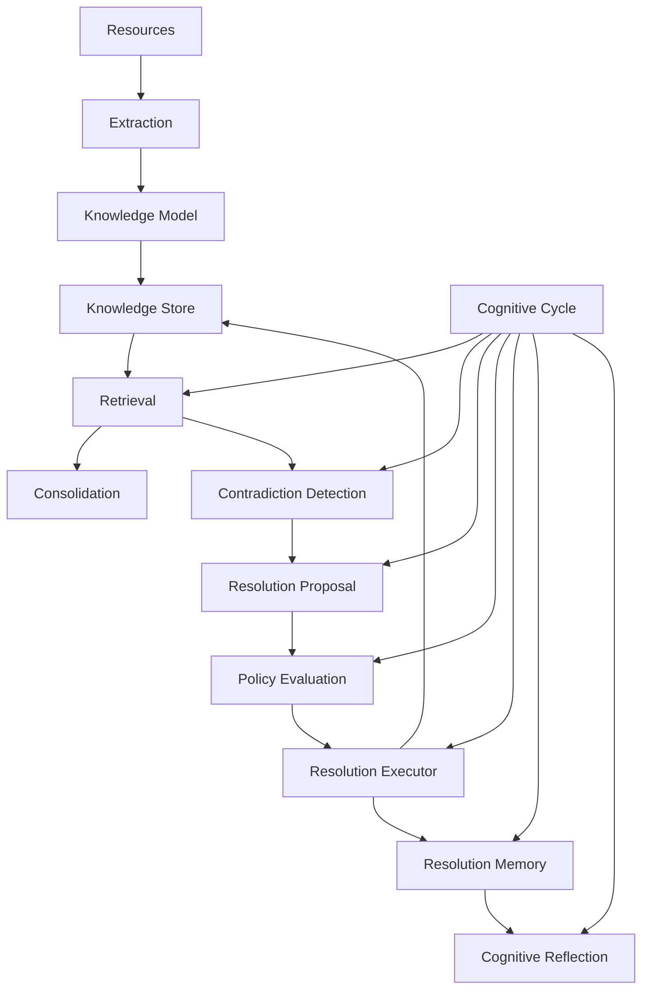

# Cognitive Layer Architecture

## Overview

The **Cognitive Layer** (Phase 8 of CMM OS) provides structured, typed, auditable, and deterministic knowledge processing capabilities. It bridges raw external resources and downstream autonomous agents without introducing unstructured text modification, non-deterministic state, or hidden side effects.

The Cognitive Layer operates entirely through explicit contracts, immutable data models, and transactional local stores.

---

## Architecture Diagram

---

## Components & Responsibilities

### 1. Resources (`cmm.cognitive.resources`)
Defines structured input containers (`Resource`, `ResourceInput`) with explicit `ResourceProvenance`, `Confidence` reliability, `ResourceTemporalScope`, sensitivity levels, and fine-grained permissions.

### 2. Extraction (`cmm.cognitive.extraction`, `service.py`, `adapters.py`)
Extracts structured candidates (`ExtractionCandidate`, `ExtractionEvidence`) from adapted resources via type-safe registries (`ResourceAdapterRegistry`, `KnowledgeExtractorRegistry`).

### 3. Knowledge Model (`cmm.cognitive.knowledge`)
Defines canonical knowledge representation contracts:
- `TemporalScope` (observed, valid, expires)
- `Evidence` (source links, locators, confidence, polarity)
- `KnowledgeRelation` (typed directional relations: supports, contradicts, supersedes, etc.)
- `KnowledgeItem` (epistemic unit with statement, kind, status, version, lineage)
- `Contradiction` (explicit conflict pair representation)
- `KnowledgeBundle` (immutable output container)

### 4. Knowledge Store (`cmm.cognitive.store_contracts`, `store_memory.py`, `store_sqlite.py`)
Provides deterministic local persistence complying with `KnowledgeStoreProtocol`.
- `InMemoryKnowledgeStore`: Fast in-memory store with snapshot-based transactional rollback.
- `SQLiteKnowledgeStore` (`LocalKnowledgeStore`): Acid-compliant SQLite store with JSON payload serialization and indexed lookup.

### 5. Knowledge Retrieval (`cmm.cognitive.query`, `retrieval.py`)
Provides structured, typed query filtering (`KnowledgeQuery`, `KnowledgeQueryResult`) and deterministic retrieval (`KnowledgeRetriever`) with sorting, pagination, temporal scoping, and batch lookup.

### 6. Knowledge Consolidation (`cmm.cognitive.consolidation`, `consolidation_contracts.py`)
Identifies candidate duplicates (`ConsolidationCandidate`), builds deterministic execution plans (`ConsolidationPlan`), and applies actions (`ConsolidationAction`) atomically with TOCTOU fingerprint verification.

### 7. Contradiction Detection (`cmm.cognitive.contradiction_detection`, `contradiction_detection_contracts.py`)
Detects conflicts using conservative rules (direct opposition pairs, structural negations with exclusions, quantitative context matching, temporal validity overlap, lineage conflict).

### 8. Contradiction Resolution Engine & Policy (`cmm.cognitive.contradiction_resolution`, `resolution_policy.py`)
- `KnowledgeContradictionResolver`: Generates resolution proposals (`ContradictionResolutionProposal`) without modifying the store.
- `ContradictionResolutionPolicyEngine`: Evaluates proposals against safety rules, outputting `ResolutionPolicyEvaluation` (`AUTO_APPROVED`, `REQUEST_HUMAN_REVIEW`, `REJECTED`, `DEFERRED`).

### 9. Resolution Executor (`cmm.cognitive.resolution_executor`)
Executes authorized proposals atomically within a store transaction. Handles item invalidation, supersession, merge, and preference while preserving historical data and producing audit logs (`ResolutionAuditRecord`).

### 10. Resolution Memory (`cmm.cognitive.resolution_memory`)
Stores non-destructive historical records (`ResolutionMemoryEntry`) of cognitive decisions and execution traces via `InMemoryResolutionMemoryStore`.

### 11. Cognitive Reflection (`cmm.cognitive.reflection`)
Performs descriptive analysis over resolution memory history to generate structured insights (`CognitiveReflectionReport`, `ReflectionFinding`). Does not modify store or policies.

### 12. Cognitive Cycle Engine (`cmm.cognitive.cognitive_cycle`)
Orchestrates end-to-end execution across retrieval, detection, proposal, policy, execution, memory, and reflection, producing an immutable audit record (`CognitiveCycleRecord`).

---

## Current Technical Limitations

- **Resolution Memory**: In-memory store implementation only (`InMemoryResolutionMemoryStore`); persistent SQLite backing is reserved for future platform phases.
- **Contradiction Detection**: Uses conservative rule-based and linguistic heuristics; does not rely on vector embeddings or LLM semantic similarity.
- **No Embeddings / Vector Search**: All search and retrieval relies on exact key indexing, text filtering (`casefold`), and explicit relational graphs.
- **Reflection is Descriptive**: Reflection generates analytical reports and metrics; it does not automatically re-train models, mutate policies, or execute store operations.
- **No Goal & Agency Layer**: The Cognitive Layer acts reactively when invoked; autonomous goal pursuit and agency are deferred to Phase 9.
