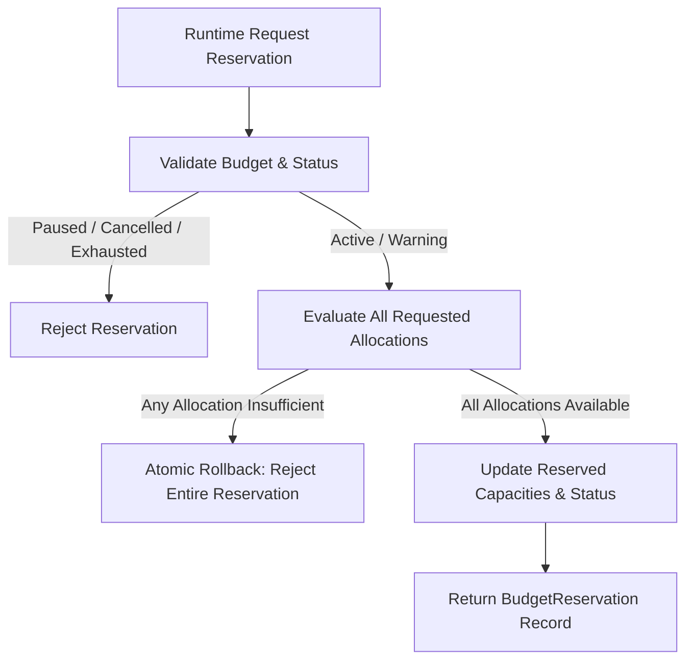

# Phase 9.11 — Action Budget

## 1. Overview and Functional Objective

The **Action Budget** system provides a deterministic, failsafe, audit-trail-backed, and resource-bounded control mechanism for autonomous `AgentRun` executions in **CMM OS**.

Its primary objective is to monitor, evaluate, reserve, and account for resource consumption during an agent run, preventing resource exhaustion, runaway costs, infinite retries/replans, or unbounded external calls.

### Core Architectural Axiom
```text
budget_available != permission
budget_available != approval
budget_available != policy_allow
budget_reservation != execution
```
Having available budget does **not** grant authorization or permission to execute an action. The runtime authorization formula remains conjunctive:
$$\text{CanExecute} = \text{PolicyAllows} \land \text{AutonomyAllows} \land \text{ApprovalSatisfied} \land \text{ValidationPassed} \land \text{BudgetAvailable}$$

The Action Budget system never executes operations by itself; it solely manages resource reservations, consumptions, expirations, and audit trails.

---

## 2. Controlled Resources

Action Budget controls 18 distinct resource categories defined in `BudgetResourceType`:

| Resource Type | Category | Numerical Type | Description |
| :--- | :--- | :--- | :--- |
| `ITERATION` | Cumulative | `int` | Runtime loop iterations |
| `OPERATION` | Cumulative | `int` | Discrete operations executed |
| `WORKFLOW` | Cumulative | `int` | Workflows executed |
| `PLAN` | Cumulative | `int` | Initial plans generated |
| `REPLAN` | Cumulative | `int` | Re-planning events triggered |
| `RETRY` | Cumulative | `int` | Retry attempts on failed operations |
| `QUESTION` | Cumulative | `int` | Clarification questions asked to user |
| `EXTERNAL_CALL` | Cumulative | `int` | External web / API calls |
| `MODEL_CALL` | Cumulative | `int` | LLM / cognitive model invocations |
| `TOKEN` | Cumulative | `int` | Aggregate token consumption |
| `COST` | Cumulative Monetary | `Decimal` | Monetary cost incurred |
| `DURATION_SECONDS` | Temporal | `int` | Total active execution duration |
| `PARALLEL_OPERATION` | Concurrent | `int` | Concurrent active operation slots |
| `STORAGE_BYTES` | Cumulative | `int` | Storage space used |
| `MEMORY_WRITE` | Cumulative | `int` | Writes to persistent memory |
| `OBSERVATION` | Cumulative | `int` | Observation snapshot cycles |
| `LOADED_RESOURCE` | Cumulative | `int` | External resources loaded into memory |
| `DATA_VOLUME_BYTES` | Cumulative | `int` | Total data bytes processed |

---

## 3. Strict Numerical Model and Fail-Safe Rules

### Precision Invariants
* **Monetary Costs (`COST`)**: Represented using Python `Decimal` to avoid floating-point rounding errors.
* **Discrete Counters**: Represented strictly as `int`.
* **Float Rejection**: Floating-point numbers are strictly rejected for resource amounts to prevent precision loss.
* **Boolean Rejection**: `bool` is rejected where numeric types are expected.
* **Non-Negative Finite Amounts**: Negative amounts and non-finite numbers (`NaN`, `Infinity`) are rejected with `InvalidActionBudgetContractError`.

---

## 4. Multi-Resource Atomic Reservations

Before executing any operation, the agent runtime must request a resource reservation via `ActionBudgetService.reserve()`.

### Atomic All-or-Nothing Guarantee
Reservations supporting multiple allocations (e.g., reserving `1 OPERATION`, `1 EXTERNAL_CALL`, and `500 TOKENS`) are strictly **atomic**:
* All requested resources must have sufficient available capacity.
* If even a single resource is insufficient, **no resources are reserved** and an `InsufficientBudgetError` (or `BudgetExhaustedError`) is raised.



---

## 5. Consumption Confirmation and Variance Handling

Once an operation completes:
1. `confirm(reservation_id, actual_allocations=...)` is called.
2. The reserved capacity is released from `reserved`.
3. The actual consumed capacity is added to `used` (except for concurrent `PARALLEL_OPERATION` which is released without accumulating in `used`).
4. An immutable `BudgetConsumption` audit record is created.

### Variance Handling
* **Actual Consumption < Reserved**: The difference is automatically freed back to available budget.
* **Actual Consumption > Reserved**: The service checks if the additional delta is available. If available, it reserves and consumes it. If unavailable, it fails closed with `InsufficientBudgetError`.

---

## 6. Reservation Expiration, Release, and Failures

### Expiration
Every reservation has an `expires_at` timestamp (default TTL: 300s).
* Reservations not confirmed or released before expiration are automatically reclaimed via `expire_due_reservations(now=...)`.
* Expired reservations cannot be confirmed.

### Release
* Unexecuted or cancelled actions release their reservation via `release()`, returning reserved capacity immediately to available pool.

### Failure Accounting
* Failed operations call `fail(reservation_id, consumed_allocations=..., reason=...)`.
* Incurred costs (e.g. partial tokens/cost spent before failure) are recorded in `used` while unspent reserved capacity is released.

---

## 7. Duration, Pause, and Resume Mechanics

For `DURATION_SECONDS`:
$$\text{ActiveElapsed} = (\text{CurrentTime} - \text{StartedAt}) - \text{TotalPausedSeconds}$$
$$\text{AvailableDuration} = \text{MaximumDuration} - \text{ActiveElapsed} - \text{ReservedDuration}$$

* `pause()` sets status to `PAUSED` and records `paused_at`. While paused, new reservations are denied.
* `resume()` sets status back to `ACTIVE` and accumulates `total_paused_seconds += (now - paused_at)`.

---

## 8. Warning and Exhaustion Thresholds

* **Warning Threshold (`warning_threshold=0.8`)**: When any controlled resource utilization reaches 80%, budget status transitions to `WARNING` and emits reason code `budget.warning_threshold_reached`.
* **Exhaustion Threshold (`1.0`)**: When any required resource reaches 100% capacity or maximum duration expires, budget status transitions to `EXHAUSTED`. New reservations are denied.

---

## 9. Authorized Adjustments and System Integration

An agent **cannot** increase its own budget. Limit increases require external human approval.

### Integration Adapters
1. **Human Approval System Adapter (`ActionBudgetApprovalAdapter`)**:
   * Generates an `ApprovalRequirement(source=BUDGET, ...)` for requesting limit increases.
   * Validates `ApprovalResolution` before applying limit increases via `increase_budget()`.
2. **Policy Engine Adapter (`ActionBudgetPolicyAdapter`)**:
   * Combines `PolicyEvaluationResult` with `BudgetEvaluationResult`.
   * A Policy `DENY` overrides budget availability, forcing evaluation to `allowed=False`.
3. **Autonomy Levels Adapter (`ActionBudgetAutonomyAdapter`)**:
   * Ensures Autonomy Evaluator decisions respect budget limits and prevents Level 4 autonomy from bypassing budget exhaustion.

---

## 10. Public API Surface

The system exports all contracts, repository abstractions, services, adapters, enums, and errors through `cmm.agent_runtime`:

```python
from cmm.agent_runtime import (
    ActionBudget,
    ActionBudgetApprovalAdapter,
    ActionBudgetAutonomyAdapter,
    ActionBudgetError,
    ActionBudgetNotFoundError,
    ActionBudgetPolicyAdapter,
    ActionBudgetRepository,
    ActionBudgetService,
    ActionBudgetStatus,
    BudgetAdjustment,
    BudgetAdjustmentType,
    BudgetAllocation,
    BudgetCancelledError,
    BudgetConsumption,
    BudgetConsumptionOutcome,
    BudgetEvaluationResult,
    BudgetExhaustedError,
    BudgetIncreaseNotAuthorizedError,
    BudgetPausedError,
    BudgetPolicyIntegrationError,
    BudgetReservation,
    BudgetReservationAlreadyResolvedError,
    BudgetReservationExpiredError,
    BudgetReservationNotFoundError,
    BudgetReservationStatus,
    BudgetResourceType,
    InMemoryActionBudgetRepository,
    InsufficientBudgetError,
    InvalidActionBudgetContractError,
)
```

---

## 11. Code Example

```python
from decimal import Decimal
from cmm.agent_runtime import (
    ActionBudgetService,
    BudgetAllocation,
    BudgetResourceType,
)

# 1. Initialize service and create budget
service = ActionBudgetService()
budget = service.create_budget(
    agent_run_id="agent-run-101",
    limits={
        BudgetResourceType.OPERATION: 50,
        BudgetResourceType.EXTERNAL_CALL: 10,
        BudgetResourceType.COST: Decimal("15.00"),
    },
)

# 2. Reserve resources before execution
reservation = service.reserve(
    budget_id=budget.id,
    allocations=[
        BudgetAllocation(BudgetResourceType.OPERATION, 1),
        BudgetAllocation(BudgetResourceType.EXTERNAL_CALL, 1),
        BudgetAllocation(BudgetResourceType.COST, Decimal("0.50")),
    ],
    operation_id="op-http-get-1",
)

# 3. Confirm consumption upon execution success
consumption = service.confirm(
    reservation_id=reservation.id,
    actual_allocations=[
        BudgetAllocation(BudgetResourceType.OPERATION, 1),
        BudgetAllocation(BudgetResourceType.EXTERNAL_CALL, 1),
        BudgetAllocation(BudgetResourceType.COST, Decimal("0.35")), # Lower actual cost
    ],
)
```

---

## 12. Relationship with Future Phases

* **Phase 9.12 (Runtime Loop)**: Will call `evaluate()`, `reserve()`, and `confirm()` at each step transition.
* **Phase 9.13 (Execution Adapter)**: Will pass exact operation allocation requirements to Action Budget before calling low-level execution adapters.
* **Phase 9.14 (Recovery Manager)**: Will inspect Action Budget consumption history during failure handling to evaluate partial outcomes and decide whether to retry, replan, pause, or request a budget increase.
