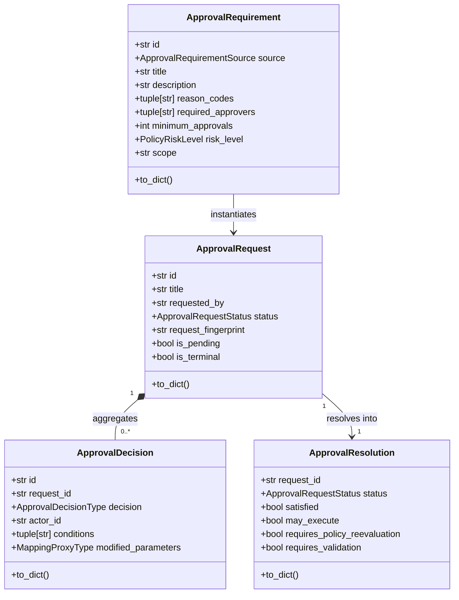
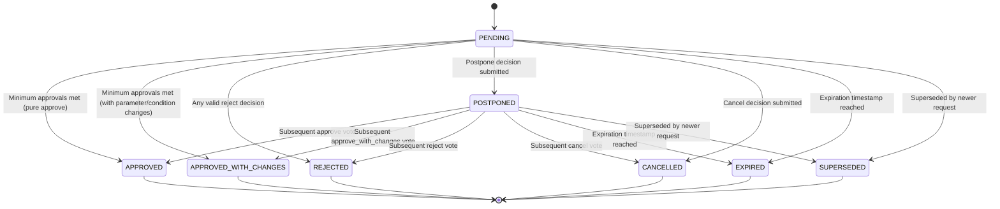

# Phase 9.10 — Human Approval System Architecture

## 1. Overview and Core Purpose

The **Human Approval System** (Phase 9.10) provides a generic, deterministic, auditable, and persistable framework for managing human intervention within the **Autonomous Agent Runtime** of CMM OS.

When an operational step, policy rule, autonomy level restriction, or workflow plan mandates human oversight, the execution runtime halts or pauses, generates a structured `ApprovalRequest`, and waits for authorized human decision-making.

> [!IMPORTANT]
> **Explicit Distinctions & Boundaries**:
> * `approval != permission` — Human approval does NOT grant permanent or global IAM permissions.
> * `approval != policy allow` — Human approval does NOT override a binding `DENY` decision from Policy Engine.
> * `approval != validation` — Human approval does NOT guarantee code or technical validity.
> * `approval != execution` — The Human Approval System NEVER executes operations directly.

---

## 2. Design Principles and Invariants

1. **Fail-Safe Closed**: Any unknown state, expired request, unauthorized actor, insufficient approvals, or malformed parameters cause the system to block or deny execution (`may_execute=False`). Approval is never assumed.
2. **Conjunctive Authorization**: Effective runtime execution permission is a strict logical conjunction:
   $$\text{may\_execute}_{\text{effective}} = \text{policy\_allows} \land \text{autonomy\_allows} \land \text{approval\_satisfied} \land \text{permissions\_satisfied} \land \text{validation\_satisfied} \land \text{budget\_satisfied}$$
3. **Structured Non-Inference**: Risk level, sensitivity, and authorization requirements are determined solely from explicit, structured data contracts—never parsed or inferred from free-text descriptions or titles.
4. **Immutability & Auditability**: All requests, decisions, and resolutions are frozen dataclasses (`@dataclass(frozen=True, slots=True)`), fully serializable, timestamped with timezone-aware UTC `datetime` objects, and traceable via stable SHA-256 request fingerprints.

---

## 3. Domain Contracts



### 3.1 ApprovalRequirement
Declares a structured pre-request requirement emitted by Policy, Autonomy, or Workflow engines before creating an actual stored request.

### 3.2 ApprovalRequest
Represents a persistent, traceable approval request. Contains target IDs (`agent_run_id`, `goal_id`, `workflow_id`, `operation_id`), risk level, expected effects, side effects, rollback availability, required approver IDs, minimum required approvals, expiration timestamp, status, and request fingerprint.

### 3.3 ApprovalDecision
Immutable record of an individual human actor's decision (`approve`, `approve_with_changes`, `reject`, `postpone`, `cancel`).

### 3.4 ApprovalResolution
Aggregated status of a request derived from all recorded decisions. Explicitly exposes flags for required downstream re-evaluations: `requires_policy_reevaluation`, `requires_validation`, `requires_budget_recalculation`, `requires_plan_update`.

---

## 4. State Machine and Transition Rules



### Precedence Rules
1. **Recedence Precedence**: Any valid `REJECT` decision immediately resolves the request to `REJECTED` (`may_execute=False`).
2. **Cancellation Precedence**: Any `CANCEL` decision immediately resolves the request to `CANCELLED` (`may_execute=False`).
3. **Approval Threshold**: If unique approving actors $\ge \text{minimum\_approvals}$ and no rejection/cancellation exists:
   * If at least one decision was `APPROVE_WITH_CHANGES`, status becomes `APPROVED_WITH_CHANGES`. Satisfied is `True`, but `may_execute` remains `False` until policy and validation re-evaluations are completed.
   * If all decisions were pure `APPROVE`, status becomes `APPROVED`, `satisfied=True`, and `may_execute=True`.

---

## 5. Decision Types and Behaviors

### 5.1 Rejection
Marking a request as `REJECTED` prevents execution (`may_execute=False`). Re-submitting an identical request with the exact same fingerprint without relevant parameter/scope changes is prohibited.

### 5.2 Approval with Changes (`approve_with_changes`)
When an approver modifies parameters or imposes execution conditions:
* Original parameters are preserved alongside `approved_parameters`.
* Modifications are validated for structure and JSON serializability.
* Downstream re-evaluation flags (`requires_policy_reevaluation=True`, `requires_validation=True`, etc.) are raised.
* Direct execution is NOT allowed (`may_execute=False`) until re-validation succeeds.

### 5.3 Postponement (`postpone`)
`POSTPONE` pauses a request without rejecting it. It keeps execution blocked (`may_execute=False`) and remains auditable until a subsequent decision or expiration occurs.

### 5.4 Expiration (`expire`)
Requests whose `expires_at` timestamp is past current UTC time cannot be approved. Attempts to submit decisions on expired requests raise `ApprovalExpiredError`.

### 5.5 Supersession (`supersede`)
An active (`PENDING` or `POSTPONED`) request can be superseded by a new request. The old request transitions to `SUPERSEDED` (`may_execute=False`), establishing a bidirectional traceability link with `supersedes_request_id` and `superseded_by_request_id`.

---

## 6. Functional Adapters

Pure translation functions convert upstream subsystem outputs into canonical `ApprovalRequirement` instances:

* `create_requirement_from_policy(policy_result, ...)`
  * Translates policy requirements or obligations.
  * **Fail-safe invariant**: A `PolicyDecision.DENY` or `denied=True` result CANNOT be converted into an approvable request and raises `ApprovalPolicyIntegrationError`.
* `create_requirement_from_autonomy(autonomy_result, ...)`
  * Translates autonomy level elevation checks.
  * **Fail-safe invariant**: An `AutonomyDecision.DENY` or `denied=True` result CANNOT be converted into an approvable request and raises `ApprovalAutonomyIntegrationError`.
* `create_requirement_from_workflow_plan(plan, node_id, ...)`
  * Translates approval DAG nodes within an `AgentWorkflowPlan`.

---

## 7. Public API Usage Example

```python
from cmm.agent_runtime import (
    ApprovalService,
    ApprovalDecisionType,
    create_requirement_from_policy,
)

# 1. Instantiate service
svc = ApprovalService()

# 2. Create approval request
request = svc.create_request(
    title="Approve database schema migration",
    description="Add index to order_history table.",
    requested_by="agent-db-maintenance",
    required_approvers=("user-alice", "user-bob"),
    minimum_approvals=2,
)

# 3. Submit first approval vote
res1 = svc.approve(request.id, actor_id="user-alice", comment="LGTM")
assert res1.may_execute is False  # Still needs 2nd vote

# 4. Submit second approval vote with modified timeout parameter
res2 = svc.approve_with_changes(
    request.id,
    actor_id="user-bob",
    modified_parameters={"lock_timeout_ms": 3000},
    conditions=("Execute during low-traffic window",),
)

assert res2.satisfied is True
assert res2.status.value == "approved_with_changes"
assert res2.requires_policy_reevaluation is True
assert res2.may_execute is False  # Requires re-validation before execution
```

---

## 8. Relationship to Future Subsystems (9.11–9.14)

* **Phase 9.11 — Action Budget**: Consumes `ApprovalResolution` to verify if approved modified parameters alter resource or token expenditure limits.
* **Phase 9.12 — Runtime Loop & Execution Adapter**: Interrogates `may_execute(request_id)` before invoking any operation handler.
* **Phase 9.13 — Agent Governance**: Audits all recorded `ApprovalDecision` entities and request fingerprints for compliance reporting.
* **Phase 9.14 — Verification & Full Integration**: Runs full end-to-end integration tests verifying that human approval correctly unblocks gated workflow execution.
