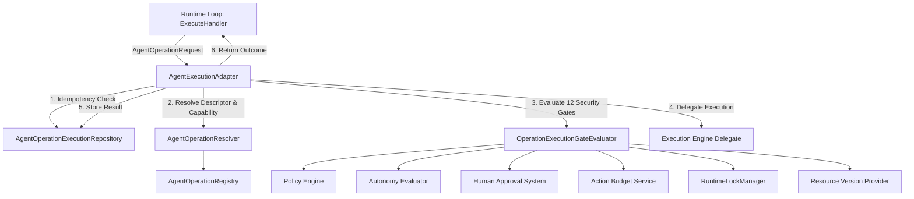

# Phase 9.13 Architecture: Operation Selection and Execution Adapter

## 1. Overview

Phase 9.13 implements the **Operation Selection and Execution Adapter** for the CMM OS Autonomous Agent Runtime.

The objective of this layer is to enable the Agent Runtime Loop to select and execute registered system operations under strict fail-closed governance, **without allowing arbitrary command execution**, shell invocation, reflection, or bypass of security gates.

---

## 2. Fundamental Invariants

The architecture explicitly enforces that operational transitions are not equivalent:

```text
registered operation != authorized operation
authorized operation != approved operation
approved operation   != budgeted operation
budgeted operation   != validated operation
execution requested  != execution completed
reversible declared  != rollback guaranteed
```

---

## 3. Core Architecture & Components



---

## 4. Components Breakdown

### 4.1 AgentOperationRequest & Fingerprinting
`AgentOperationRequest` is an immutable, timezone-aware, JSON-serializable dataclass representing an operational request.

Each request computes a deterministic SHA256 fingerprint:

```python
fingerprint = sha256(
    operation_name + operation_version + normalized_parameters + environment + resource_versions + constraints + permissions + expected_effects
)
```

If parameters or environment are mutated after Human Approval, the request's fingerprint changes, invalidating the approval token and causing approval gate rejection.

### 4.2 OperationDescriptor & OperationCapability
- `OperationDescriptor`: Declarative schema of registered operations (inputs, outputs, reversibility, rollback operation, required permissions, sensitivity, timeout, cost).
- `OperationCapability`: Configured boundary restriction for an operation (maximum uses limit, allowed environments, expiration time, approval requirements).

### 4.3 AgentOperationRegistry & Resolver
- `AgentOperationRegistry`: Thread-safe, in-memory registry requiring exact `(name, version)` pairs. Arbitrary dynamic imports, fallbacks to "latest", or default operation fallbacks are strictly prohibited.
- `AgentOperationResolver`: Resolves exact descriptors and validates capability usage bounds (`maximum_uses` per `agent_run_id`).

### 4.4 The 12 Pre-Execution Security Gates
Before delegating execution to the underlying engine, `OperationExecutionGateEvaluator` evaluates 12 gates:
1. **Registry Gate**: Exact operation name and version registered and enabled.
2. **Parameters Gate**: Input schema type, required keys, ranges, and enums validated.
3. **Capability Gate**: Operation allowed, expiration unexpired, maximum uses limit unexceeded.
4. **Environment Gate**: Request environment matched against descriptor/capability allowed targets.
5. **Permissions Gate**: Required permissions satisfied by request.
6. **Autonomy Gate**: Autonomy Level checked.
7. **Policy Gate**: Policy Engine evaluated.
8. **Approval Gate**: Approval resolution verified against request fingerprint.
9. **Budget Gate**: Action Budget checked and reserved.
10. **Checkpoint Gate**: Checkpoint freshness verified.
11. **Resource Version Gate**: Pre-execution resource hashes matched.
12. **Lock Gate**: Incompatible active locks checked via `RuntimeLockManager`.

### 4.5 Execution Delegation & Idempotency
- Execution is delegated to a registered executor or backend delegate (`TransformationExecutionEngineAdapter`).
- Re-invoking an existing `idempotency_key` with the exact same request fingerprint returns the previous `AgentOperationExecutionResult`. Re-invoking with a conflicting payload raises `AgentOperationIdempotencyConflictError`.

### 4.6 Runtime Loop Integration
`ExecuteHandler` in `runtime_handlers.py` receives the runtime context:
- If `AgentExecutionAdapter` is injected, it delegates execution strictly to it.
- If no adapter or explicit delegate function is supplied, `ExecuteHandler` raises `RuntimeStepExecutionError`, ensuring arbitrary execution is impossible.

---

## 5. Public API Exports

Module `cmm.agent_runtime` exports:
- `AgentOperationRequest`
- `OperationDescriptor`
- `OperationCapability`
- `OperationExecutionGateResult`
- `AgentOperationExecutionResult`
- `AgentOperationRegistry`, `InMemoryAgentOperationRegistry`
- `AgentOperationExecutionRepository`, `InMemoryAgentOperationExecutionRepository`
- `AgentOperationResolver`, `AgentExecutionAdapter`
- `OperationExecutionGateEvaluator`
- `AgentOperationExecutionStatus`, `OperationEffectType`, `OperationReversibility`, `OperationEnvironment`
- `AgentOperationError` and 25 typed domain exception subclasses.

---

## 6. Auditability & Telemetry

All requests and execution results are persisted in `AgentOperationExecutionRepository` with timestamps, reason codes, budget consumption references, and resource version diffs.

---

## 7. Relationship to Phase 9.14

Phase 9.13 establishes the secure execution adapter. Phase 9.14 (Outcome Evaluation & Validation Adapter) will consume the structured `AgentOperationExecutionResult`, `artifacts`, and `side_effects` to perform post-execution verification and goal criteria evaluation.
