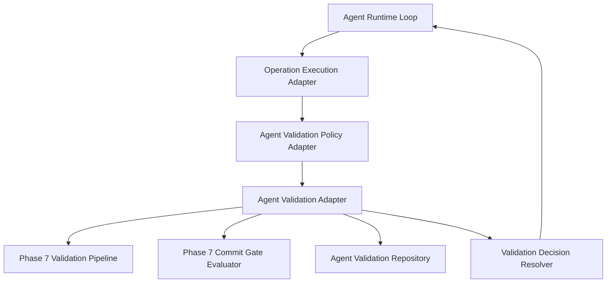

# Phase 9.14 – Agent Runtime Validation Integration

## Overview & Architecture

Phase 9.14 integrates the **CMM Agent Runtime** with the established **Validation Infrastructure (Phase 7)**. Rather than duplicating existing validation engines, rules, or commit gate components, Phase 9.14 bridges the Agent Runtime lifecycle with `ValidationPipeline`, `CommitGateEvaluator`, and `ValidationPolicy` through deterministic, non-bypassable adapters and contracts.

## Key Components & Responsibilities

### 1. Validation Contracts & Enums
- **`ValidationRequirement`**: Immutable dataclass defining a specific validation check required before, during, or after operation execution.
- **`AgentValidationRequest`**: Contextual request containing stage, requirements, idempotency key, and SHA256 fingerprint.
- **`AgentValidationResult`**: Immutable result capturing findings, reports, commit gate evaluations, and deterministic decisions.
- **`AgentValidationStage`**: Stages (`PRE_EXECUTION`, `POST_EXECUTION`, `PRE_COMMIT`, `POST_ROLLBACK`).
- **`AgentValidationDecision`**: Explicit closed enum (`CONTINUE`, `BLOCK`, `RETRY`, `REPLAN`, `ROLLBACK`, `ESCALATE`, `PAUSE`, `ABORT`).

### 2. Validation Policy Selection (`AgentValidationPolicyAdapter`)
- Resolves cumulative validation requirements based on operation descriptors, capabilities, reversibility, environment, sensitivity, and policy rules.
- Mandatory Rules:
  - Mutative operations enforce `POST_EXECUTION` validation.
  - Destructive operations require blocking pre-execution checks.
  - Code-modifying operations require `SYNTAX` validation.
  - Python file modifications require `AST` and unit/integration test execution.
  - Commit or publish operations enforce `CommitGateEvaluator` checks (`PRE_COMMIT`).
  - Human approvals cannot bypass or override technical validation.
- `requirement_id`s are deterministic (derived from operation name/version/stage, never random `uuid4`), so a resolved requirement's identity is stable across calls and cannot be silently displaced by an agent-supplied "custom" requirement reusing the same id.

### 3. Validation Adapter & Decision Resolver (`AgentValidationAdapter`)
- Delegates validation execution to the real Phase 7 `ValidationPipeline` (`build_default_validation_pipeline()` by default). The adapter never executes subprocess, shell, pytest, or lint tooling itself.
- Translates `ValidationRequirement.validator_ids` into concrete Phase 7 `ValidationStep` builders (`syntax_validator` -> `syntax_step()`, `ast_validator` -> `ast_step()`, `affected_tests_step` -> `affected_tests_step(context)`). This mapping is the *only* translation Phase 9.14 performs; execution itself always runs through the real pipeline. A `required=True` requirement whose `validator_ids` cannot be resolved raises `ValidationAdapterError` (fail-safe) instead of being silently skipped.
- Evaluates Commit Gate eligibility by calling the real `CommitGateEvaluator.evaluate(validation_result, policy)` — there is no parallel/duplicated gate logic. The commit policy is resolved via Phase 7's `resolve_validation_policy`, falling back to the strictest known policy (`full`) if the requested policy name cannot be resolved.
- Enforces a resource fingerprint check: when `context_data["expected_resource_fingerprint"]` is supplied alongside a non-empty resource scope, the adapter recomputes a SHA-256 content fingerprint over those paths and denies commit authorization on any mismatch, even if the underlying Phase 7 gate would otherwise authorize.
- Emits deterministic decisions mapped to Runtime Loop transitions.

### 4. Persistence & Idempotency (`InMemoryAgentValidationRepository`)
- Thread-safe repository protected via `RLock`.
- Idempotency invariants:
  - Matching idempotency key + matching payload fingerprint -> Returns existing result.
  - Matching idempotency key + conflicting payload fingerprint -> Raises `ValidationRepositoryError`.
  - Immutable final results cannot be mutated or overwritten.

## Operational Flow

1. **Pre-Validation**: Evaluates preventive requirements prior to operation execution. If blocked, operation execution is aborted, budget is unconsumed, and locks are safely released.
2. **Execution**: Delegates transformation logic to registered operation handlers.
3. **Post-Validation**: Validates modified resources, python AST/syntax, affected test suites, and regression checks.
4. **Commit Gate**: Evaluates repository safety and authorization before persisting iteration commits.
5. **Runtime Decision Mapping**:
   - `CONTINUE` -> Advance to evaluation / next iteration step.
   - `BLOCK` -> Transition to `BLOCKED` status.
   - `RETRY` -> Trigger controlled retry in `RECOVERING`.
   - `REPLAN` -> Transition to `PLANNING` state.
   - `ROLLBACK` -> Trigger rollback recovery.
   - `ESCALATE` -> Escalate to human review in `WAITING_FOR_APPROVAL`.
   - `PAUSE` -> Pause run execution in `PAUSED`.
   - `ABORT` -> Finalize run with `FAILED` status.

## Security & Reliability Invariants

- **No Subprocess Bypass**: Agent Runtime delegates all execution to registered validation components; direct shell calls are prohibited.
- **Fail-Safe Exception Handling**: Infrastructure failures wrap in `ValidationInfrastructureError` and never degrade to artificial success or warnings.
- **No Policy Downgrading**: Agents cannot disable required validations or reduce policy strictness.
- **Audit Traceability**: All validation events incorporate timezone-aware ISO timestamps and unique correlation identifiers.

## Extension for Phase 10

Phase 9.14 lays the groundwork for Phase 10 Multi-Agent Collaboration and Advanced Governance. The explicit decision mapping and repository persistence enable cross-agent validation coordination and distributed policy enforcement.
